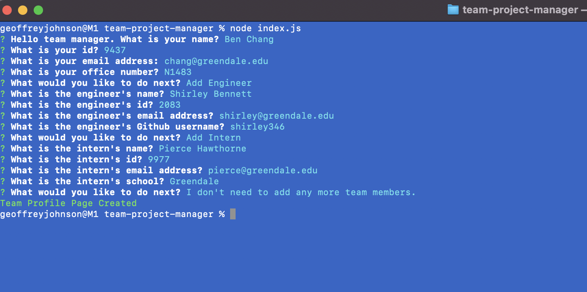

# Team-Project-Manager

## Table of Contents
* [Description](#description)
* [Screenshots](#screenshot)
* [Installation](#installation)
* [Usage](#usage)
* [Link](#link)
* [Code](#code)
* [Contact](#contact)
* [Technologies](#technologies)
* [Tests](#tests)
* [Project Status](#project-status)

## Description 
This a Node.js command-line application that allows a manager to enter team member data to create a formatted HTML webpage. It also contains tests for each of the classes used in the application.

## Screenshots




## Installation
Install npm dependencies:
```bash
npm install
```

## Usage
The application can be invoked with the following command:
```bash
node index.js
```

## Link
[Video Walkthrough](https://drive.google.com/drive/folders/1CaQdwbri9IfzgB0sODRviMSXnWazbVtD?usp=sharing)


## Code
[GitHub Code Repository](https://github.com/Johny49/team-project-generator)


## Contact 
Created by [@johny49](https://github.com/Johny49/) - feel free to contact me!


## Technologies
- HTML
- Bootstrap
- JavaScript
- Node
- Inquirer.js
- Jest

## Tests
Tests have been created for the Employee, Manager, Engineer, and Intern Classes.  To run the tests, install npm dependencies, then run the following command:
```bash
npm test
```

## Project Status
Project is: completed and functioning as intended.
